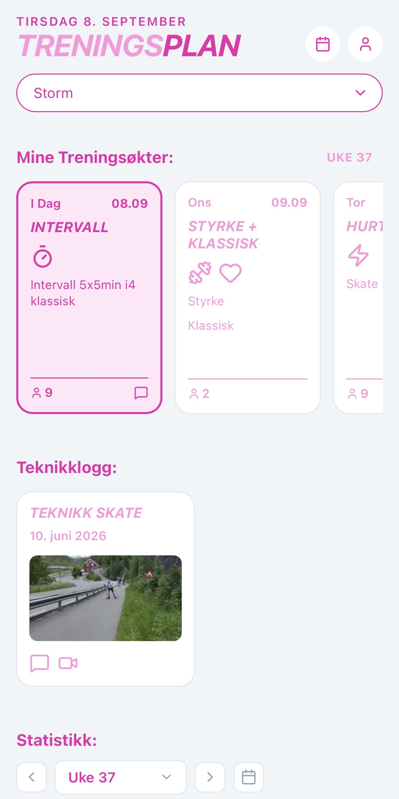
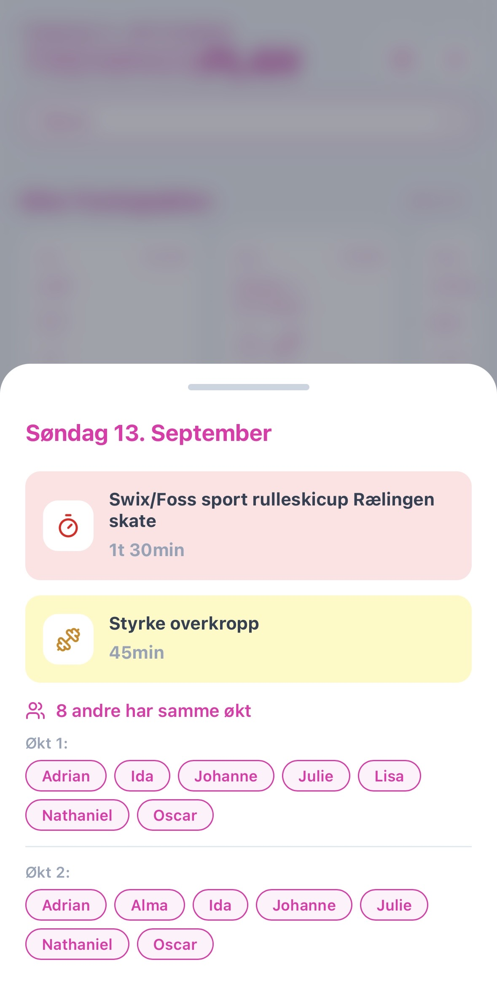
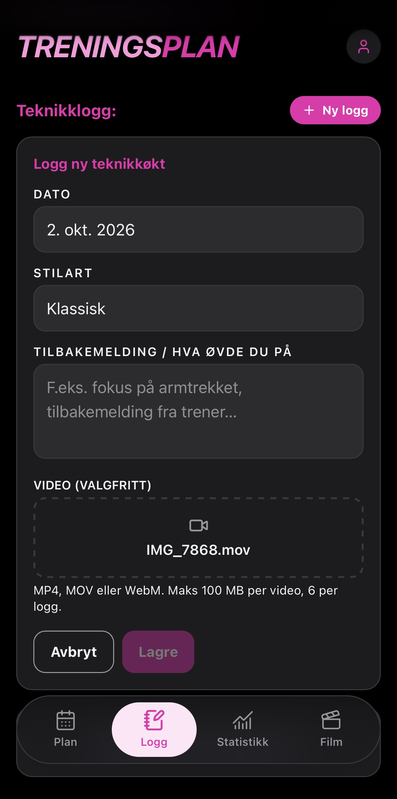

# Treningsplan for langrenn

En webapp for planlegging, oppfølging og treningsloggføring for langrennsutøvere. Jeg utviklet løsningen i jobben som trener i Asker Skiklubb Langrenn etter at oppfølgingen ble stadig mer tidkrevende da gruppen vokste fra fem til fjorten utøvere.

Målet var å samle treningsplaner og oppfølging på ett sted, slik at treneren får bedre oversikt og utøverne enklere finner og forstår øktene sine. Under utviklingen ble det også tydelig at mye egentrening kunne gjøre treningshverdagen ensom. Derfor ble appen utvidet med en funksjon som synliggjør hvem som har tilsvarende økter samme dag, og gjør det enklere å planlegge trening sammen.

## Effekt i bruk

- Som trener har jeg halvert tiden jeg bruker på oppfølging ved å samle utøverne i ett dashboard.
- Utøverne bruker over halvparten mindre tid på å finne dagens økter enn med regnearkets mobilgrensesnitt.
- Oversikten over fellesøkter gjør det enklere for utøverne å koordinere egentrening med hverandre.

## Funksjonalitet

### For utøveren

- Se treningsplanen i en mobiltilpasset kalender- og dagsoversikt.
- Utforske økter og treningsmengde med statistikk for uke, måned og sesong.
- Se hvilke andre utøvere som har samme økt samme dag.
- Opprette, redigere og følge egen teknikklogg med kommentar og video, for å dokumentere utvikling over tid.
- Åpne treningsplanen i Google Sheets for redigering og bruke øvrige treningsressurser.

### For treneren

- Søke opp utøvere og se treningsplanen deres fra samme grensesnitt.
- Få oversikt over hvilke utøveres planer som er klare for ferdigstilling.
- Følge teknikklogger som del av oppfølgingen.

## Slik fungerer det

1. Et redigerbart Google-regneark brukes som arbeidskilde for treningsplanene. Det er strukturert med egne ark for ulike perioder, blant annet måneder.
2. Et Google Apps Script kjører hvert 30. minutt. Det oppdaterer regnearkskilden for hver utøver og sammenligner øktene for å lage et eget regneark med fellesøkter.
3. Webappen henter treningsplanene og fellesøktene fra Google Sheets som CSV-data og viser dem i utøver- og trenergrensesnittet.
4. Teknikklogger lagres i Neon/PostgreSQL. Videoer lastes opp til Cloudinary, og URL-ene knyttes til loggene.

Fellesøkter sammenlignes foreløpig ut fra dato og lik øktbeskrivelse. Dette fungerer godt når én trener lager planene for hele gruppen. For flere trenere eller grupper vil sammenligningen trenge en mer robust metode enn lik tekst.

Apps Script-automatiseringen og regnearkene er eksterne deler av løsningen og ligger ikke i dette repositoryet.

## Teknologier

- **SvelteKit** og **Svelte 5** for webapp og serverruter
- **TypeScript** og **JavaScript** for applikasjonslogikk
- **Tailwind CSS** for styling
- **Vite** for utvikling og bygging
- **Google Sheets** og **Google Apps Script** for treningsplaner, synkronisering og beregning av fellesøkter
- **Neon Serverless Postgres** for teknikklogger
- **Cloudinary** for videolagring
- **Vercel** for hosting og **Vercel Analytics**
- **Papa Parse** for parsing av CSV-data, **date-fns** for dato- og kalenderlogikk og **Lucide** for ikoner

## Arkitektur og avgrensning

Appen har to roller: utøver og trener. Treningsplanene administreres i Google Sheets, mens webappen gir en samlet og mer tilgjengelig flate for visning og oppfølging. Innlogging og API-tilgang håndteres av serverrutene i SvelteKit.

Løsningen er laget for en lukket gruppe med kjente brukere og er et praktisk verktøy for treningsplanlegging, ikke et system for behandling av sensitive helseopplysninger. Dagens struktur og tilgangsmodell er valgt for å få en nyttig løsning i bruk for treneren og utøverne. Dersom appen åpnes for flere trenere, utøvere eller grupper, må blant annet gruppeseparasjon, tilgangsstyring og matching av økter videreutvikles for den bredere bruken.

## Videre arbeid

- Gjøre sammenligning av økter mindre avhengig av fritekst og lik øktbeskrivelse.
- Videreutvikle struktur og tilgangsstyring for mulig bruk på tvers av trenere og treningsgrupper.

## Demo

